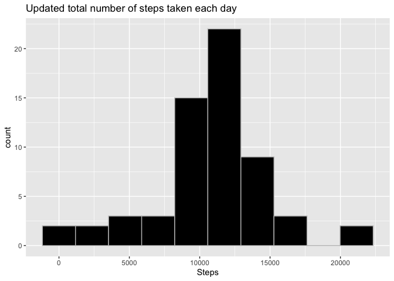

Activity_monitoring
================
Nikhil Agrawal
2023-02-25

## Introduction

It is now possible to collect a large amount of data about personal
movement using activity monitoring devices such as a Fitbit, Nike
Fuelband, or Jawbone Up. These type of devices are part of the
“quantified self” movement – a group of enthusiasts who take
measurements about themselves regularly to improve their health, to find
patterns in their behavior, or because they are tech geeks. But these
data remain under-utilized both because the raw data are hard to obtain
and there is a lack of statistical methods and software for processing
and interpreting the data.

This assignment makes use of data from a personal activity monitoring
device. This device collects data at 5 minute intervals through out the
day. The data consists of two months of data from an anonymous
individual collected during the months of October and November, 2012 and
include the number of steps taken in 5 minute intervals each day.

The data for this assignment can be downloaded from the course web site:

-   Dataset: [Activity monitoring
    data](https://d396qusza40orc.cloudfront.net/repdata%2Fdata%2Factivity.zip)

The variables included in this dataset are:

1.  steps: Number of steps taking in a 5-minute interval (missing values
    are coded as NA) </br>
2.  date: The date on which the measurement was taken in YYYY-MM-DD
    format </br>
3.  interval: Identifier for the 5-minute interval in which measurement
    was taken </br>

The dataset is stored in a comma-separated-value (CSV) file and there
are a total of 17,568 observations in this dataset.

## Load libraries

``` r
library(magrittr)
library(dplyr)
```

    ## 
    ## Attaching package: 'dplyr'

    ## The following objects are masked from 'package:stats':
    ## 
    ##     filter, lag

    ## The following objects are masked from 'package:base':
    ## 
    ##     intersect, setdiff, setequal, union

``` r
library(ggplot2)
```

## Loading and preprocessing the data

Download dataSet to /activity_monitoring directory and unzip data to
obtain a csv file.

``` r
if(!file.exists("./activity_monitoring")){dir.create("./activity_monitoring")}
url <- "https://d396qusza40orc.cloudfront.net/repdata%2Fdata%2Factivity.zip"
download.file(url,destfile="./activity_monitoring/Dataset.zip")
unzip(zipfile="./activity_monitoring/Dataset.zip",exdir="./activity_monitoring")
```

## Reading the data and quick summary

``` r
Activity_df <- read.csv("./activity_monitoring/activity.csv", stringsAsFactors = FALSE)
Activity_df$date <- as.Date(Activity_df$date)

str(Activity_df)
```

    ## 'data.frame':    17568 obs. of  3 variables:
    ##  $ steps   : int  NA NA NA NA NA NA NA NA NA NA ...
    ##  $ date    : Date, format: "2012-10-01" "2012-10-01" ...
    ##  $ interval: int  0 5 10 15 20 25 30 35 40 45 ...

``` r
summary(Activity_df)
```

    ##      steps             date               interval     
    ##  Min.   :  0.00   Min.   :2012-10-01   Min.   :   0.0  
    ##  1st Qu.:  0.00   1st Qu.:2012-10-16   1st Qu.: 588.8  
    ##  Median :  0.00   Median :2012-10-31   Median :1177.5  
    ##  Mean   : 37.38   Mean   :2012-10-31   Mean   :1177.5  
    ##  3rd Qu.: 12.00   3rd Qu.:2012-11-15   3rd Qu.:1766.2  
    ##  Max.   :806.00   Max.   :2012-11-30   Max.   :2355.0  
    ##  NA's   :2304

## What is mean total number of steps taken per day?

### Total number of steps per day

``` r
agg_steps_df <- Activity_df %>% group_by(date) %>% summarise(total_steps = sum(steps, na.rm = TRUE))
agg_steps_df
```

    ## # A tibble: 61 × 2
    ##    date       total_steps
    ##    <date>           <int>
    ##  1 2012-10-01           0
    ##  2 2012-10-02         126
    ##  3 2012-10-03       11352
    ##  4 2012-10-04       12116
    ##  5 2012-10-05       13294
    ##  6 2012-10-06       15420
    ##  7 2012-10-07       11015
    ##  8 2012-10-08           0
    ##  9 2012-10-09       12811
    ## 10 2012-10-10        9900
    ## # … with 51 more rows

### Histogram of the total number of steps taken each day

``` r
ggplot(agg_steps_df, aes(x = total_steps)) +
  geom_histogram(bins = 10, fill = "black", col = "grey") +
  xlab("Steps") +
  ggtitle("Total number of steps taken each day")
```

<!-- -->

### Mean and median steps per day

``` r
mean_steps_per_day <- mean(agg_steps_df$total_steps)
median_steps_per_day <- median(agg_steps_df$total_steps)
mean_steps_per_day
```

    ## [1] 9354.23

``` r
median_steps_per_day
```

    ## [1] 10395

## What is the average daily activity pattern?

### Time series plot of average number of steps taken

``` r
agg_pattern_df <- Activity_df %>% group_by(interval) %>% summarise(avg_steps = mean(steps, na.rm = TRUE))
ggplot(agg_pattern_df, aes(x = interval, y = avg_steps)) +
  geom_line(color = "blue") +
  xlab("Interval") + 
  ylab("Average number of steps") +
  ggtitle("Time-series plot: Average number of steps taken vs interval")
```

<!-- -->

### 5-minute interval containing the maximum number of steps

``` r
max_steps <- max(agg_pattern_df$avg_steps)
agg_pattern_df %>% filter(avg_steps == max_steps)
```

    ## # A tibble: 1 × 2
    ##   interval avg_steps
    ##      <int>     <dbl>
    ## 1      835      206.

## Imputing missing values

### Total count with missing values (NA)

``` r
naCount <- sum(!complete.cases(Activity_df))
naCount
```

    ## [1] 2304

### Strategy for filling in all of the missing values: Mean of that day

``` r
interval_avg <- Activity_df %>% group_by(interval) %>% summarise(avg_steps = mean(steps, na.rm = TRUE))
```

### New dataset with the missing data filled in.

``` r
Activity_df_imputed <- Activity_df
for (i in 1:nrow(Activity_df_imputed)) {
  if (is.na(Activity_df_imputed[i, "steps"]) == TRUE) {
    data_interval <- Activity_df_imputed[i, "interval"]
    imputed_value <- interval_avg[interval_avg$interval == data_interval, "avg_steps"]
    Activity_df_imputed[i, "steps"] <- imputed_value
  } else {
    Activity_df_imputed[i, "steps"] <- Activity_df_imputed[i, "steps"]
  }
}
```

### Histogram of updated dataset

``` r
updated_agg_steps_df <- Activity_df_imputed %>% group_by(date) %>% summarise(total_steps = sum(steps, na.rm = TRUE))
ggplot(updated_agg_steps_df, aes(x = total_steps)) +
  geom_histogram(bins = 10, fill = "black", col = "grey") +
  xlab("Steps") +
  ggtitle("Updated total number of steps taken each day")
```

<!-- -->

### Mean and median of updated dataset

``` r
updated_mean_steps_per_day <- mean(updated_agg_steps_df$total_steps)
updated_median_steps_per_day <- median(updated_agg_steps_df$total_steps)
updated_mean_steps_per_day
```

    ## [1] 10766.19

``` r
updated_median_steps_per_day
```

    ## [1] 10766.19

### Difference between the mean and median of two datasets

``` r
meandiff <- updated_mean_steps_per_day - mean_steps_per_day
mediandiff <- updated_median_steps_per_day - median_steps_per_day
meandiff
```

    ## [1] 1411.959

``` r
mediandiff
```

    ## [1] 371.1887

## Variation in activity patterns between weekdays and weekends

### New variable with two levels – “weekday” and “weekend”

``` r
Activity_df$weekday_indicator <- ifelse(weekdays(Activity_df$date) %in% c("Saturday", "Sunday"), "weekend", "weekday")
```

### Panel plot containing time-series of average number of steps taken

``` r
week_agg_steps_df <- Activity_df %>% group_by(interval, weekday_indicator) %>% summarise(avg_steps = mean(steps, na.rm = TRUE))
```

    ## `summarise()` has grouped output by 'interval'. You can override using the
    ## `.groups` argument.

``` r
ggplot(week_agg_steps_df, aes(x = interval, y = avg_steps,color = weekday_indicator)) +
  geom_line(stat="identity") +
  theme(legend.position="none") +
  facet_wrap(~weekday_indicator) +
  labs(x="interval", y=expression("Average number of steps")) + 
  labs(title=expression("Weekday vs Weekend activity patterns"))
```

<!-- -->
